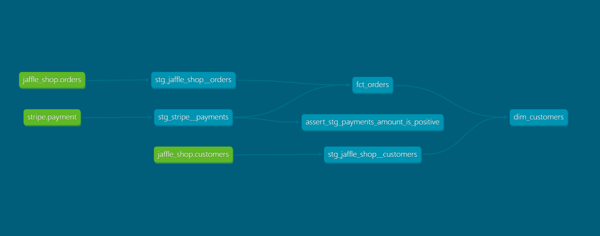

# Stripe Analytics




```markdown
# Stripe Analytics

This repository contains the `stripe-analytics` project, developed as part of the [dbt Fundamentals course](https://learn.getdbt.com/learn/course/dbt-fundamentals) by dbt Labs. The project demonstrates the application of dbt (data build tool) for transforming and analyzing Stripe payment data.

## Project Overview

The `stripe-analytics` project showcases the following dbt features:

- **Models**: SQL files that define transformations to raw Stripe data, creating clean and analysis-ready datasets.
- **Sources**: Definitions of raw data sources, enabling source freshness checks and documentation.
- **Tests**: Built-in and custom tests to ensure data quality and integrity.
- **Snapshots**: Capture and track changes in slowly changing dimensions over time.
- **Documentation**: Auto-generated documentation for models and sources, enhancing project transparency.

## Getting Started

To explore this project:

1. **Clone the repository**:

   ```bash
   git clone https://github.com/pareekshitreddy/stripe-analytics.git
   ```

2. **Set up the environment**:

   Ensure you have dbt installed. If not, follow the installation guide in the [official dbt documentation](https://docs.getdbt.com/docs/installation).

3. **Configure the profile**:

   Update the `profiles.yml` file with your data warehouse connection details. Refer to the [dbt profile setup guide](https://docs.getdbt.com/docs/configure-your-profile) for assistance.

4. **Install dependencies**:

   Navigate to the project directory and run:

   ```bash
   dbt deps
   ```

5. **Run dbt commands**:

   - Compile models:

     ```bash
     dbt compile
     ```

   - Execute models:

     ```bash
     dbt run
     ```

   - Run tests:

     ```bash
     dbt test
     ```

   - Generate documentation:

     ```bash
     dbt docs generate
     ```

   - Serve documentation locally:

     ```bash
     dbt docs serve
     ```

## Resources

- **dbt Fundamentals Course**: [dbt Fundamentals](https://learn.getdbt.com/learn/course/dbt-fundamentals)
- **dbt Documentation**: [Official dbt Docs](https://docs.getdbt.com/)
- **dbt Learn**: [Learn dbt with courses and workshops](https://www.getdbt.com/dbt-learn)

## Acknowledgments

This project was completed as part of the dbt Fundamentals course by dbt Labs, which offers comprehensive training on dbt and analytics engineering.

For more information on dbt and available courses, visit [dbt Learn](https://www.getdbt.com/dbt-learn).
```

This `README.md` provides an overview of the `stripe-analytics` project, instructions for setup and execution, and references to additional resources for further learning. 
   
